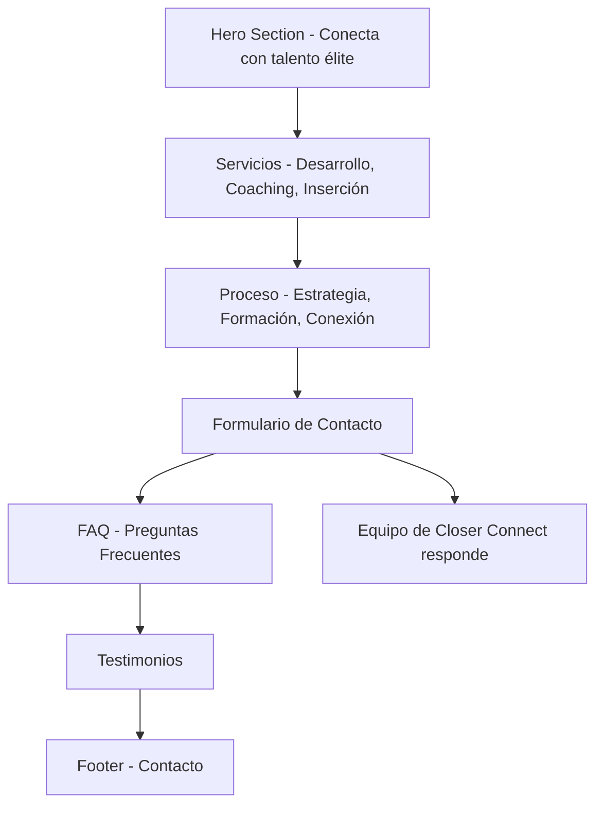

## 1. Product Overview
Página web de una sola página para Closer Connect, una empresa especializada en conectar talento élite en ventas con oportunidades laborales. La plataforma sirve como punto de encuentro entre profesionales de ventas y empresas que buscan talento comercial de alto nivel.

El producto resuelve el problema de la conexión entre empresas que necesitan vendedores expertos y profesionales de ventas que buscan nuevas oportunidades laborales, facilitando un proceso eficiente de matchmaking profesional.

## 2. Core Features

### 2.1 User Roles
| Role | Registration Method | Core Permissions |
|------|---------------------|------------------|
| Visitante | Sin registro | Navegar por toda la información del sitio, acceder a servicios, FAQ y testimonios |
| Candidato | Formulario de contacto | Enviar información de contacto para recibir ofertas laborales |
| Empresa | Formulario de contacto | Solicitar servicios de reclutamiento y coaching |

### 2.2 Feature Module
El sitio web consiste en los siguientes módulos principales:
1. **Hero section**: Presentación principal con mensaje "Conecta con talento élite en ventas".
2. **Servicios**: Sección de "A qué nos dedicamos" con servicios de Desarrollo, Coaching e Inserción.
3. **Proceso**: Sección "Cómo Funciona" con pasos de Estrategia, Formación y Conexión.
4. **Formulario de Contacto**: Campos de Nombre, Teléfono, Email y Selector de Rol.
5. **FAQ**: Preguntas frecuentes sobre el servicio.
6. **Testimonios**: Opiniones de clientes y candidatos satisfechos.
7. **Footer**: Información de contacto y enlaces relevantes.

### 2.3 Page Details
| Page Name | Module Name | Feature description |
|-----------|-------------|---------------------|
| Página Principal | Hero Section | Presentación visual con título "Conecta con talento élite en ventas", subtítulo descriptivo y llamada a la acción principal. Diseño impactante con imagen de fondo profesional. |
| Página Principal | Servicios | Mostrar tres servicios principales: Desarrollo (formación de equipos comerciales), Coaching (mentoría personalizada) e Inserción (colocación de talento). Cada servicio con icono, título y descripción breve. |
| Página Principal | Proceso | Explicar el proceso en tres pasos: Estrategia (análisis de necesidades), Formación (capacitación especializada) y Conexión (matchmaking profesional). Diseño visual con timeline o cards. |
| Página Principal | Formulario de Contacto | Formulario con campos para Nombre, Teléfono, Email y selector desplegable de Rol (Candidato/Empresa). Botón de envío con validación de campos requeridos. |
| Página Principal | FAQ | Lista de preguntas frecuentes expandibles con respuestas. Temas sobre proceso de selección, tarifas, tipos de perfiles, tiempo de colocación. |
| Página Principal | Testimonios | Carrusel o grid de testimonios con foto, nombre, cargo y texto de recomendación de clientes y candidatos exitosos. |
| Página Principal | Footer | Información de contacto (email, teléfono, dirección), enlaces a redes sociales, menú de navegación secundario y derechos de autor. |

## 3. Core Process

### Flujo de Usuario Principal
1. El visitante accede a la página principal y ve la hero section con el mensaje principal
2. Desplazándose hacia abajo, descubre los servicios ofrecidos por Closer Connect
3. Continúa explorando el proceso paso a paso de cómo funciona el servicio
4. Si está interesado, completa el formulario de contacto seleccionando su rol
5. Puede revisar las preguntas frecuentes para resolver dudas
6. Lee testimonios de otros usuarios para validar la calidad del servicio
7. Finalmente, encuentra información de contacto en el footer

## 4. User Interface Design

### 4.1 Design Style
- **Colores principales**: Azul profesional (#1E3A8A) como color primario, blanco (#FFFFFF) para fondos, gris oscuro (#374151) para texto
- **Colores secundarios**: Azul claro (#60A5FA) para acentos, verde (#10B981) para botones de acción
- **Estilo de botones**: Botones redondeados con sombra sutil, hover effects con transiciones suaves
- **Tipografía**: Fuente moderna sans-serif (Inter o similar), tamaños: 16px para texto normal, 48px para títulos principales, 24px para subtítulos
- **Estilo de layout**: Diseño limpio y profesional con secciones claramente diferenciadas, uso de cards para servicios y testimonios
- **Iconos**: Estilo lineal moderno, consistente en todo el sitio

### 4.2 Page Design Overview
| Page Name | Module Name | UI Elements |
|-----------|-------------|-------------|
| Hero Section | Hero principal | Imagen de fondo con overlay oscuro, título en blanco de 48px, subtítulo de 24px, botón CTA verde con texto blanco, diseño centrado y responsive |
| Servicios | Cards de servicio | Tres cards horizontales con iconos circulares, títulos de 20px, descripciones de 16px, sombra sutil en hover, fondo blanco con bordes redondeados |
| Proceso | Timeline visual | Tres pasos numerados con línea conectora, iconos personalizados por paso, títulos de 18px, descripciones de 14px, diseño alternado para versión desktop |
| Formulario | Campos de entrada | Inputs con bordes redondeados de 8px, labels flotantes, selector desplegable personalizado, botón de envío ancho con color verde, validación visual con bordes rojos en error |
| FAQ | Acordeón expandible | Preguntas con icono de + para expandir, fondo gris claro en hover, transición suave al abrir/cerrar, respuestas con padding interno |
| Testimonios | Carrusel o grid | Cards con foto circular de 80px, nombre en negrita, cargo en gris, texto de testimonio en cursiva, controles de navegación para carrusel |
| Footer | Información de contacto | Fondo azul oscuro, texto blanco, iconos de redes sociales circulares, enlaces organizados en columnas, copyright centrado al final |

### 4.3 Responsiveness
- Diseño desktop-first con adaptación mobile
- Breakpoints: 768px para tablets, 480px para móviles
- Menú hamburguesa para navegación móvil
- Cards de servicios apiladas verticalmente en móvil
- Formulario con campos apilados en versión móvil
- Optimización de tipografías y espaciados para cada tamaño de pantalla

### 4.4 Interacciones y Animaciones
- Scroll suave entre secciones
- Animaciones fade-in al hacer scroll hacia elementos
- Hover effects en botones y cards de servicios
- Transiciones suaves en el acordeón de FAQ
- Carrusel de testimonios con autoplay opcional